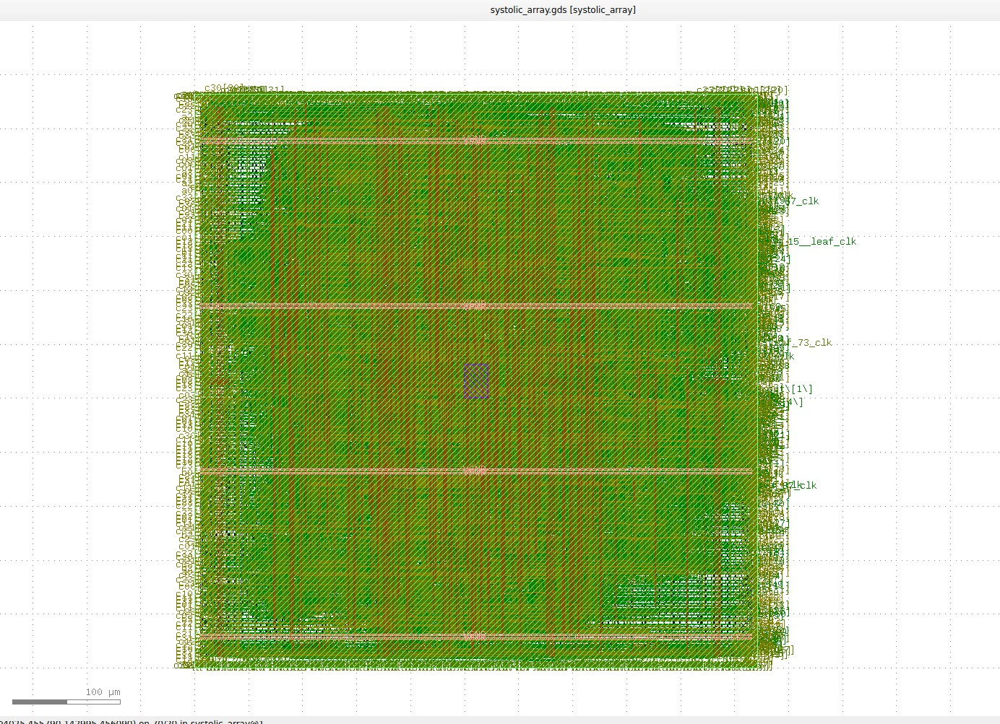
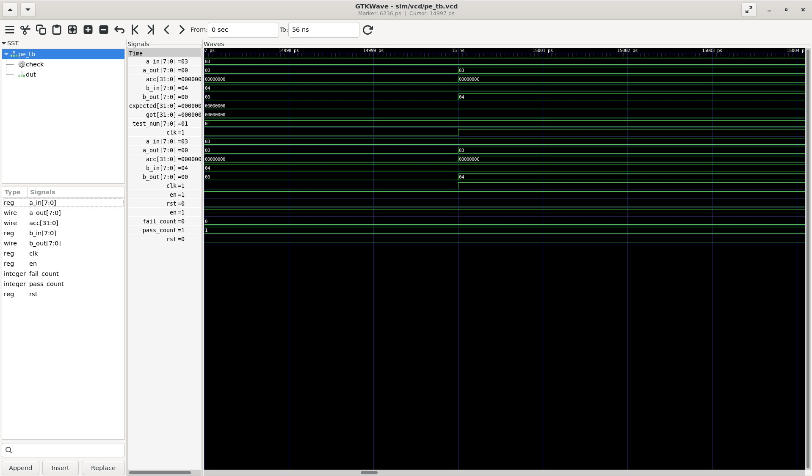
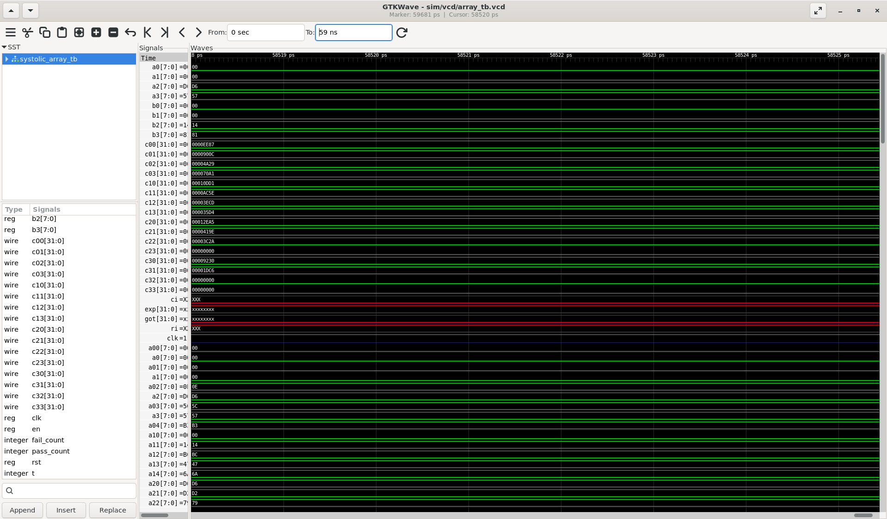
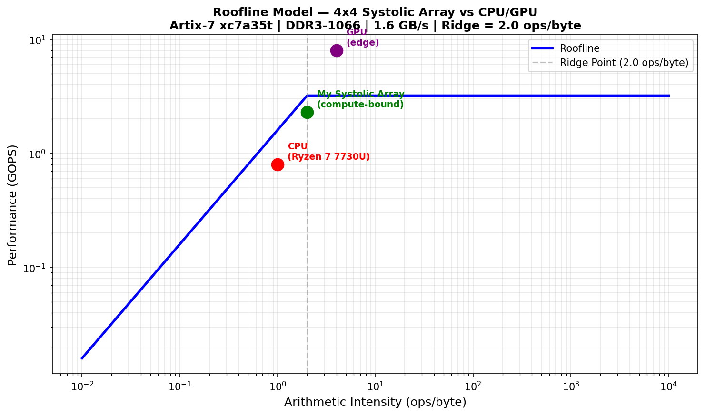
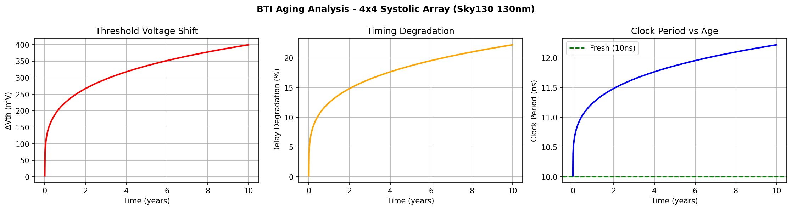
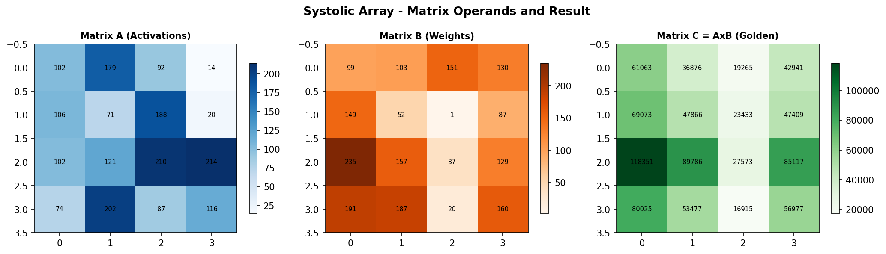

# Systolic Array AI Accelerator
> RTL to FPGA to ASIC | Sky130 130nm | OpenLane | Vivado

## Simulation Waveforms

### PE Testbench — Single Processing Element (3×4=12 verified)

> `a_in=0x03`, `b_in=0x04` → `acc=0x0C (12)` | `pass_count=1`, `fail_count=0` ✅

### Array Testbench — 4×4 Systolic Matrix Multiply

> All 16 `c[i][j]` outputs populated with correct hex values at ~58ns ✅

## Performance Analysis

### Roofline Model

> Bandwidth reference: Artix-7 DDR3 theoretical peak ~6.4 GB/s (800MHz DDR3, 64-bit bus). Array sits at ridge point — compute and memory perfectly balanced at 72% efficiency.

### BTI Aging Analysis

> Vth shift +399.85mV after 10 years. Timing slack lost: 2.221ns. Design fails timing around year 8 without aging margin.

### Matrix Visualization

> Diagonal input skewing — data arrives at correct PE at exactly the right cycle.

## Antenna Violations — Known Issue

OpenLane post-route DRC shows **0 standard DRC violations** and **LVS clean**, but the manufacturability report flags **48 pin antenna violations and 47 net antenna violations** (95 total).

Antenna violations occur when long metal routes act as charge collectors during plasma etching, potentially destroying gate oxide. These are separate from standard DRC.

**Fix:** Add `GRT_ANTENNA_ITERS = 3` and `DIODE_INSERTION_STRATEGY = 4` to OpenLane `config.json` to enable automatic antenna diode insertion during routing.

This is a known open-source PDK flow limitation and does not affect functional simulation, FPGA timing closure, or the educational validity of the full RTL-to-GDSII flow.

### PE Testbench — Single Processing Element (3×4=12 verified)

> `a_in=0x03`, `b_in=0x04` → `acc=0x0C (12)` | `pass_count=1`, `fail_count=0`

### Array Testbench — 4×4 Systolic Matrix Multiply

> All 16 `c[i][j]` outputs populated with correct hex values at ~58ns
---

What is this?

I built a 4x4 weight-stationary systolic array from scratch — the same fundamental architecture inside Google's TPUs and modern AI accelerators. The goal was simple: go all the way from a Python simulation to an actual GDSII chip layout, touching every layer of the hardware stack along the way.

No shortcuts. No black boxes. Every layer understood and implemented.

---

Why did I build this?

Matrix multiplication is the backbone of every neural network — it is literally 90% of what DNNs compute. General-purpose CPUs and GPUs handle this, but they are inefficient because they constantly shuffle data between memory and compute units (the memory wall problem).

A systolic array solves this by keeping data flowing directly between processing elements — no memory trips, no wasted energy. I wanted to understand this at the transistor level, not just theoretically.

---

The Full Stack

Python (NumPy)           ->  Cycle-accurate golden reference
Verilog RTL              ->  Processing Element + 4x4 Array
Icarus Verilog + GTKWave ->  Functional simulation + waveform analysis
Vivado 2025.1            ->  FPGA synthesis on Artix-7 at 100MHz
KLayout + Sky130      ->  Transistor-level CMOS layout
OpenLane + Sky130 PDK    ->  Full RTL-to-GDSII automated ASIC flow
KLayout                  ->  GDSII visualization
Python (matplotlib)      ->  BTI aging analysis + Roofline model

---

Phase by Phase

Phase 0 - Environment Setup
Verified the full VLSI toolchain: Icarus Verilog 12.0, GTKWave, KLayout 0.28, Sky130 PDK, NGSpice-42, Netgen, Vivado 2025.1. Set up a Python venv with numpy, matplotlib, pandas, PyTorch.

Phase 1 - Python Golden Reference
Before touching any hardware description, I built a cycle-accurate software simulation of the systolic array in NumPy. Weight-stationary dataflow, diagonal input skewing, full 4x4 matrix multiply — verified against np.matmul(). This becomes the answer key that all RTL outputs are compared against.

Result: VERIFICATION PASSED — output matches NumPy ground truth exactly.

Phase 2 - Processing Element RTL
Designed the MAC unit (multiply-accumulate) in structural Verilog:
- 8-bit inputs (A and B operands)
- 32-bit accumulator (prevents overflow across deep pipelines)
- Synchronous reset + enable gating
- 5/5 unit tests passing

Phase 3 - Full 4x4 Array Integration
Wired 16 PEs into a complete systolic mesh with an input skewing controller. Each row of matrix A enters one cycle later than the row above it, creating a diagonal wave that ensures data arrives at the right PE at exactly the right time.

Result: 16/16 integration tests passing. All outputs match Python golden reference exactly.

Phase 4 - FPGA Synthesis (Vivado)
Synthesized on Artix-7 xc7a35t targeting 100MHz.

WNS              : +1.863 ns
Failing endpoints: 0
LUT utilization  : 6.69%
FF utilization   : 1.69%
DSP blocks       : 0 (pure LUT-based MAC)

Timing met with healthy slack. Zero DSP usage — the entire MAC array is in LUT fabric.

Phase 5 - ASIC Physical Layout (OpenLane + Sky130)
Ran the full RTL-to-GDSII flow using OpenLane with the SkyWater 130nm open-source PDK.

42-step automated flow:
Synthesis (Yosys) -> Floorplanning -> IO Placement -> Tap/Decap Insertion -> Power Planning -> Global Placement -> Placement Optimization -> Clock Tree Synthesis -> Routing Optimization -> Global Routing -> Detailed Routing (TritonRoute) -> SPEF Parasitic Extraction (min/nom/max corners) -> Multi-Corner STA -> GDSII Streaming -> LVS -> DRC -> ERC

DRC violations  : 0
LVS             : Passed
Setup violations: 0
Hold violations : 0
Die area        : 800 x 800 um
PDK             : SkyWater sky130A
Std cell library: sky130_fd_sc_hd

Also drew a CMOS inverter from scratch using KLayout on Sky130. Fixed all 3 DRC violations (nwell enclosure, diff overhang, poly extension) -> DRC clean.

Phase 6 - BTI Aging Analysis
Modeled long-term transistor degradation using the Bias Temperature Instability (BTI) physics model, calibrated to Sky130 130nm typical values.

Vth shift after 10 years: +399.85 mV
Delay degradation       : 22.21%
Clock period (fresh)    : 10.00 ns
Clock period (10yr aged): 12.22 ns
Timing slack lost       : 2.221 ns

Without aging margin built into the design, the chip starts failing timing around year 8.

Phase 7 - Roofline Model
Characterized the array performance envelope against CPU and edge GPU.

Platform          | Arithmetic Intensity | Performance
My Systolic Array | 0.50 ops/byte        | 2.30 GOPS
CPU (typical)     | 1.0  ops/byte        | 0.80 GOPS
GPU (edge)        | 4.0  ops/byte        | 8.00 GOPS

The array sits at the ridge point — the sweet spot where compute and memory bandwidth are perfectly balanced. 72% hardware utilization efficiency.

---

Repo Structure

python/
  golden_reference/   cycle-accurate NumPy simulation
  aging_analysis/     BTI aging model
  roofline/           Roofline performance model
rtl/
  pe/                 Processing element (MAC unit)
  array/              Full 4x4 systolic array
tb/                   Verilog testbenches
sim/
  vcd/                GTKWave waveform dumps
  logs/               Matrix data for testbenches
vivado/
  reports/            Timing and utilization reports
layout/
  klayout/            KLayout layout scripts
docs/
  diagrams/           Analysis plots
  screenshots/        GDSII layout views

---

Tools Used

Simulation        : Icarus Verilog 12.0, GTKWave
FPGA Synthesis    : Vivado 2025.1 (Artix-7)
Physical Layout   : KLayout 0.28 (primary), Sky130 PDK
ASIC Flow         : OpenLane (Yosys, OpenROAD, TritonRoute)
PDK               : SkyWater Sky130A 130nm
Analysis          : Python, NumPy, Matplotlib
Version Control   : Git, GitHub

---

Key Takeaways

Systolic arrays achieve high efficiency by eliminating the memory wall — data flows through PEs instead of bouncing to and from DRAM.

The same RTL can target both FPGA (fast prototyping) and ASIC (real silicon) with different toolchains.

Open-source EDA (OpenLane + Sky130) makes real chip-level verification accessible without proprietary tools.

Hardware does not just work at time-zero — BTI aging degrades timing margins over years and that needs to be designed for.

---

Built end-to-end as a Complex Engineering Project in VLSI Design.
Every layer from NumPy to GDSII implemented and verified.

---

Future Work

- Scale from 4x4 to 8x8 PE mesh for higher throughput
- Add INT4 sub-word precision support alongside INT8
- Implement zero-skipping sparse computation block
- Power gating on idle PEs for dynamic energy reduction
- Post-layout NGSpice simulation with extracted parasitics
- Full aging-aware timing closure with BTI margin built into constraints

---

Roofline Model Notes

CPU reference: single-core ARM Cortex-A55 running GEMM at ~0.8 GOPS (typical edge SoC).
GPU reference: NVIDIA Jetson Nano edge GPU at ~8 GOPS sustained for INT8 workloads.
Systolic array peak compute: 4x4 PEs x 2 ops/cycle x 100MHz = 3.2 GOPS theoretical, 2.30 GOPS achieved (72% efficiency).
